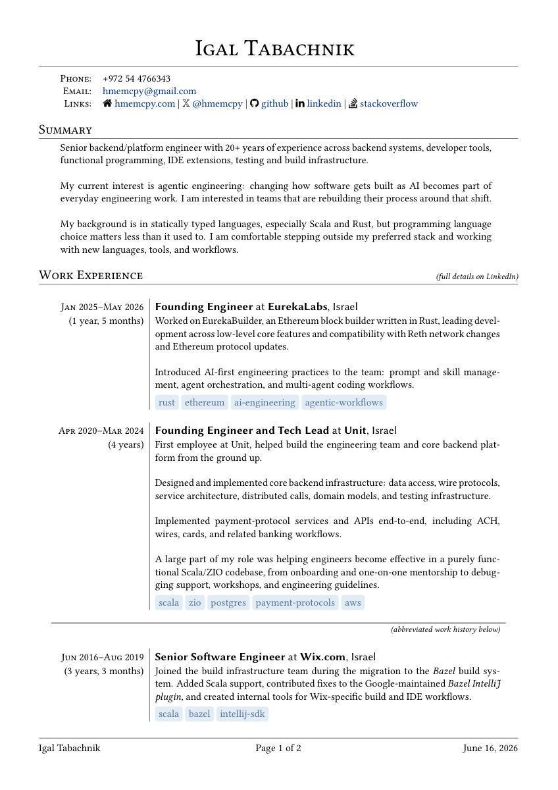
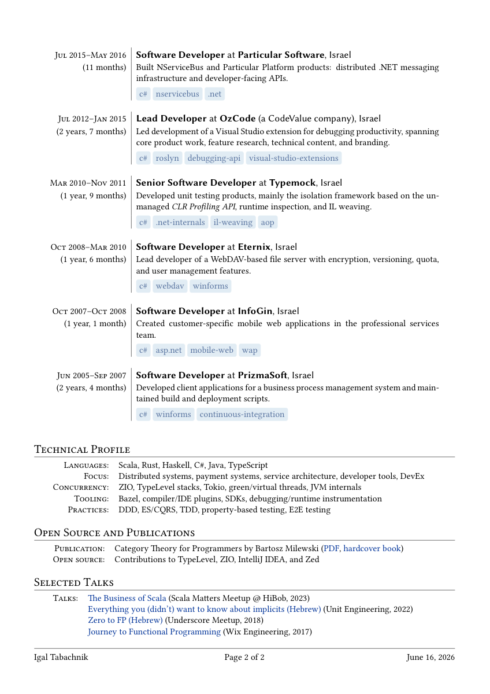

Contains the LaTeX source for my CV.

Adapted from [Professional CV](https://www.sharelatex.com/templates/cv-or-resume/professional-cv) by Alessandro Plasmati.

StackOverflow-like tags adapted from https://tex.stackexchange.com/a/311949/142692

Compiled with `lualatex` due to some known issues with FontAwesome. I currently build the PDF on Overleaf; the Nix files are kept as a local build convenience, but Overleaf is the reference environment.

## Template

The repository also includes a genericized version with placeholder content:

Use [`template.tex`](template.tex) if you want to start from this layout without my personal CV content.

## Preview

Page 1 |  Page 2
:--------------:|:---------------:
| 

